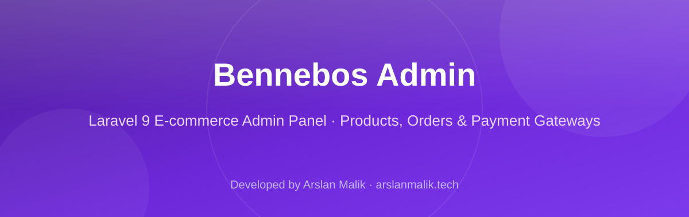
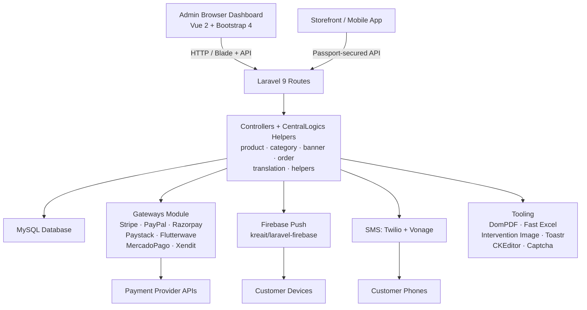

<p align="center">
  
</p>

<p align="center">


</p>

> **Developed by [Arslan Malik](https://github.com/arsalanmaalik461)**
> 📱 WhatsApp: [+92 300 8987448](https://wa.me/923008987448) · 🌐 Website: [arslanmalik.tech](https://arslanmalik.tech)

---

## 🌟 Executive Overview

**Bennebos Admin** is a full-featured e-commerce admin panel built on **Laravel 9** (PHP 8). It provides everything needed to run the backend of an online store from a single dashboard: product and category management, order processing, promotional banners, multi-currency support, and a plug-in **payment gateways module** covering Stripe, PayPal, Razorpay, Paystack, Flutterwave, MercadoPago, and Xendit.

The project is built on a modular architecture using `nwidart/laravel-modules`, with dedicated CentralLogics helper libraries for products, categories, orders, banners, SMS, and translations. Customer engagement is handled through **Firebase push notifications** and **SMS notifications** (Twilio + Vonage), while the API surface is secured with **Laravel Passport**. Admin tooling includes PDF generation (DomPDF), Excel import/export, image processing, a CKEditor rich-text editor, and toast notifications.

The repo ships deployment-ready: an `installation/` bundle with SQL database dumps, currency data, and public assets makes it possible to set the store up on shared hosting, with `index.php` and `.htaccess` at the project root.

---

## 📑 Table of Contents

- [✨ Key Features & Highlights](#-key-features--highlights)
- [🖥️ Feature Showcase](#️-feature-showcase)
- [🏗️ System Architecture](#️-system-architecture)
- [🚀 Quickstart & Installation Guide](#-quickstart--installation-guide)
- [📂 Project Structure](#-project-structure)
- [🛡️ Security & Notes](#️-security--notes)

---

## ✨ Key Features & Highlights

| Feature | Description |
| :--- | :--- |
| 🛍️ Product & Category Management | Full catalog management with dedicated CentralLogics helpers for products and categories |
| 🧾 Order Management | Order processing helpers covering the full order lifecycle |
| 🖼️ Banner Management | Promotional banner management for storefront marketing |
| 💳 Payment Gateways | Pluggable gateways module: Stripe, PayPal, Razorpay, Paystack, Flutterwave, MercadoPago, Xendit |
| 🔔 Firebase Push Notifications | Real-time push notifications via Firebase (`firebase-messaging-sw.js` included) |
| 📲 SMS Notifications | Transactional SMS through Twilio and Vonage (`sms_module.php`) |
| 🔐 API Authentication | Laravel Passport-powered API security |
| 🧾 PDF Generation | PDF documents (e.g. invoices) via Barryvdh DomPDF |
| 📊 Excel Import/Export | Fast Excel spreadsheet import/export |
| 🖌️ Image Processing | Server-side image handling with Intervention Image |
| ✍️ Rich Text Editor | CKEditor for formatted content |
| 🍞 Toast Notifications | UI toast notifications via Laravel Toastr |
| 🤖 Captcha Protection | gregwar/captcha form protection |
| 🧩 Modular Architecture | `nwidart/laravel-modules` based `Modules/` directory for plug-in features |
| 🌍 Multi-language | Built-in translation helper layer |
| 💱 Multi-currency | Currency data bundle shipped in `installation/currency.json` |
| 🎨 Asset Pipeline | Vue 2 + Bootstrap 4 frontend built with Laravel Mix |

---

## 🖥️ Feature Showcase

### 1. Catalog & Order Management

> Manage the entire storefront catalog — products, categories, promotional banners, and customer orders — through centralized helper libraries.

- `app/CentralLogics/product.php`, `category.php`, `banner.php`, `order.php` centralize catalog and order business logic
- CKEditor-powered rich product descriptions, Intervention Image for product imagery
- Excel import/export for bulk catalog operations
- Order status flow backed by the database migrations in `database/`

### 2. Payments & Gateways Module

> A dedicated `Modules/`-based gateways architecture wired to seven payment providers out of the box.

- Stripe, PayPal (REST SDK), Razorpay, Paystack, Flutterwave (LaravelRave), MercadoPago, Xendit
- Gateway enable/disable state tracked in `modules_statuses.json`
- Multi-currency readiness via the bundled `installation/currency.json` data

### 3. Notifications & Engagement

> Keep customers and admins in the loop with push and SMS notifications.

- Firebase Cloud Messaging integration with `kreait/firebase-php` + `kreait/laravel-firebase`, plus a ready `firebase-messaging-sw.js` service worker
- SMS via Twilio SDK and the Vonage notification channel, wrapped in `sms_module.php`
- Laravel Toastr toasts for in-dashboard admin feedback

---

## 🏗️ System Architecture



---

## 🚀 Quickstart & Installation Guide

### Prerequisites

- PHP `^8.0` with `ext-curl`, `ext-json`, `ext-zip`
- Composer
- MySQL
- Node.js + npm (for the Laravel Mix asset build)

### Step-by-Step Installation

```bash
# 1. Clone the repository
git clone https://github.com/arsalanmaalik461/Bennebos-Admin.git
cd Bennebos-Admin

# 2. Install PHP dependencies
composer install

# 3. Configure the environment
cp .env.example .env
php artisan key:generate

# 4. Set your database credentials in .env, then run migrations
php artisan migrate

# 5. (Alternative) Import one of the bundled SQL dumps from installation/
#    (e.g. database.sql, database_v7.1.sql) for a pre-seeded setup,
#    including the currency data in installation/currency.json

# 6. Install frontend dependencies and build assets
npm install
npm run prod   # or: npm run dev for development

# 7. Serve the application
php artisan serve
# visit http://localhost:8000
```

For shared-hosting deployments, point the web root at the project root — `index.php` and `.htaccess` are provided there.

---

## 📂 Project Structure

```
Bennebos-Admin/
├── app/
│   ├── CentralLogics/        # Domain helpers: banner, category, product,
│   │                         #   order, sms_module, translation, helpers
│   ├── Http/                 # Controllers, middleware
│   ├── Library/              # Constant.php, Responses.php
│   └── Models/               # Eloquent models
├── bootstrap/                # Laravel bootstrap
├── config/                   # Laravel configuration
├── database/                 # Migrations, seeders, factories
├── docs/
│   └── assets/
│       └── banner.svg        # Project banner
├── installation/             # Installer bundle: SQL dumps (database*.sql),
│                             #   currency.json, public.zip, route activators
├── Modules/                  # nwidart/laravel-modules plug-in modules
├── public/                   # Web-accessible assets
├── resources/                # Blade views, Vue components, lang files
├── routes/                   # Web + API routes
├── storage/                  # Logs, cache, uploads
├── stubs/                    # Module stubs
├── tests/                    # PHPUnit test suite
├── .env.example              # Environment template
├── artisan                   # Laravel CLI
├── composer.json             # PHP dependencies (Laravel 9, Passport, Firebase, ...)
├── firebase-messaging-sw.js  # Firebase push service worker
├── index.php / .htaccess     # Shared-hosting entry point at project root
├── package.json              # Vue 2 + Bootstrap 4 via Laravel Mix
├── phpunit.xml               # PHPUnit config
├── server.php                # Dev server entry
├── webpack.mix.js            # Mix asset build config
└── README.md
```

---

## 🛡️ Security & Notes

- **Never commit real credentials**: `.env` is gitignored — always start from `.env.example` and keep production keys (payment gateway secrets, Firebase config, Twilio/Vonage tokens, Passport keys) out of the repo.
- **Run `php artisan key:generate`** after cloning so sessions, cookies, and encrypted data use a fresh application key.
- **Regenerate Passport keys** (`php artisan passport:install`) on every fresh deployment instead of reusing keys from another environment.
- **Protect the `installation/` SQL dumps**: delete or restrict the `installation/` directory on production so database backups cannot be downloaded.
- **Queues for notifications**: route Firebase push and SMS jobs through a queue worker in production so slow providers never block requests.
- **Validate file uploads**: Intervention Image is configured for processing — enforce mime-type and size validation on all user uploads before processing.
- **Captcha on public forms**: the bundled `gregwar/captcha` protects admin-facing forms; keep it enabled on login and registration routes.
- **Keep dependencies current**: run `composer update` / `npm audit` periodically and review advisories for gateway SDKs before upgrading.

---

<p align="center">
  <sub>Developed with ❤️ by <a href="https://github.com/arsalanmaalik461">Arslan Malik</a> · 📱 <a href="https://wa.me/923008987448">WhatsApp: +92 300 8987448</a> · 🌐 <a href="https://arslanmalik.tech">arslanmalik.tech</a></sub>
</p>
